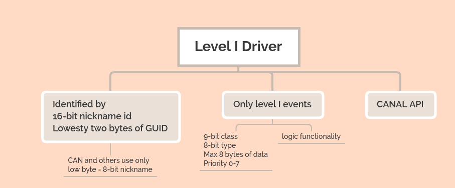
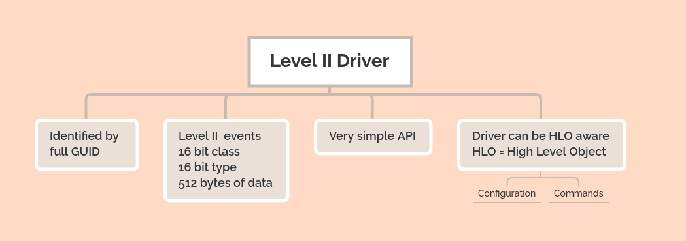

# VSCP Driver interfaces

This document describes the various driver interfaces used in VSCP implementations, including both hardware and software drivers. These interfaces facilitate communication between the VSCP core and the underlying hardware or software components.

Drivers can be used by servers like the [VSCP Daemon](https://grodansparadis.github.io/vscp/#/) or by embedded VSCP nodes to interface with different types of hardware or communication protocols and to extend functionality. Drivers can aso be used by the [VSCP Works](https://grodansparadis.github.io/vscp-works-qt/#/) application to provide access to different hardware interfaces.

There is a list of currently available drivers for  [level I](https://docs.vscp.org/#level1drv) and [level II](https://docs.vscp.org/#level2drv).

## Level I drivers



This driver type is also called **CANAL** (CAN Abstraction Layer) drivers after the driver API they use. Most of them have no relation to [CAN](https://sv.wikipedia.org/wiki/Controller_Area_Network) other than the CANAL API which is used as a least common denominator allowing this type of driver handle many types of busses and devices.

The driver itself is just a shared library, a .dll (Windows) or a .so (Linux) file with the Level I/CANAL interface exported. The CANAL interface is described [here](https://docs.vscp.org/canal/latest/#/). 

Many ready to use Level I drivers are available for VSCP & Friends. A list of drivers can be found [here](https://docs.vscp.org/#level1drv). Documentation, usage and install instructions can be found by going to each drivers repository.

The good thing with the Level I interface is that you can add the .dll or .so as a driver for use with the [VSCP daemon](https://grodansparadis.github.io/vscp/#/) or use the dll/so directly from your own application such as in [VSCP Works](https://grodansparadis.github.io/vscp-works-qt/#/).

To make your own Level I driver just create a dynamically linked library that export the CANAL interface. There are plenty of examples to use as a starting point for creating your own driver in the [source tree for the VSCP & Friends package at GitHub](https://github.com/grodansparadis?tab=repositories&q=vscpl1drv&type=&language=). 

For Python developers [python-can](https://python-can.readthedocs.io/en/stable/) is a good tool. __Unfortunately__ the CANAL interface is named USB2CAN here but it is there and follows the CANAL spec.

## Add and configure a driver

Go to the repository for the driver and download it and install it.

The configuration for a typical VSCP driver on a specific platform is described ion that platform. For the [VSCP Daemon](https://grodansparadis.github.io/vscp/#/) is done in the vscpd.json configuration file which looks something like this

```json
{
  "enable" : false,
  "name" : "can4vscp",
  "config" : "/dev/ttyUSB0",
  "flags" : 0,
  "translation" : 2,
  "path" : "/var/lib/vscp/drivers/level1/vscpl1drv-can4vscp.so",
  "guid" : "FF:FF:FF:FF:FF:FF:FF:F5:01:00:00:00:00:00:00:02",

  "mqtt" : {
    ...
  }
}
```

The settings for the above is documented is in the [configuration section](https://grodansparadis.github.io/vscp/#/configuring_the_vscp_daemon). 

Other software like [VSCP Works](https://grodansparadis.github.io/vscp-works-qt/#/) have their own way of configuring drivers. Typically this is done via a GUI. See the documentation for the specific software for details. VSCP Works uses [connections](https://grodansparadis.github.io/vscp-works-qt/#/connections).

## Level II drivers



Level II drivers are extremely simple API drivers that can be used to extend the capabilities of VSCP software like [VSCP Works](https://grodansparadis.github.io/vscp-works-qt/#/) and the [VSCP Daemon](https://grodansparadis.github.io/vscp/#/) and be used as an alternative driver approach (as of level I drivers) for devices. They can connect to different type of hardware or logical functionality. Level II drivers has two advantages over Level I drivers. 

*  They always use the Level II event format which means that the full GUID is used. 
*  They have a **VERY** simple API consisting of only four methods.

The ability to use the full GUID is good as there is no need for translation schema's between the actual GUID and GUID's used in interfaces. The GUID is unique all over the world.

Letting the driver talk to the daemon over the MQTT interface is favorable in that it can do many things that previously has been impossible. The most exciting is that it can read and write variables. This is the recommended way to use for configurations of a Level II driver. It means that configuration of all drivers can be made in one place (the daemon variable file), it gives a possibility to change run time values in real time etc.

The level II driver is, just as the Level I driver, a shared library, a .dll (Windows) or a .so (Linux), with a specific set of exported methods. The exported methods are four of the methods from the CANAL interface and uses identical calling parameters and return values. There are some differences however noted below. 

## Add and configure a driver

Go to the repository for the driver and download it and install it.

The configuration for a VSCP driver is different on different host software. For the [VSCP Daemon](https://grodansparadis.github.io/vscp/#/) the configuration is in the vscpd.json file and looks like this

```json
{
    "enable" : false,
    "name" : "tcpiplink",
    "path-driver" : "/var/lib/vscp/drivers/level2/vscpl2drv-tcpiplink.so",
    "path-config" : "/var/lib/vscp/vscpd/tcpiplink.conf",
    "guid" : "FF:FF:FF:FF:FF:FF:FF:F5:09:00:00:00:00:00:00:00",
    "mqtt" : {
        ...
    }
}
```

This includes the driver and extend the functionality of the [VSCP Daemon](https://grodansparadis.github.io/vscp/#/).
The settings for the above is documented is in the [configuration section](https://grodansparadis.github.io/vscp/#/configuring_the_vscp_daemon).

How this is done for other software like [VSCP Works](https://grodansparadis.github.io/vscp-works-qt/#/) is described in the documentation for that specific software.

The driver configuration file is documented in the drivers own documentation.

## Creating your own driver
To make a Level II driver just create a dynamically linked library that export the Level II interface (described below). There are plenty of examples to use as a starting point for creating your own driver. Use one of the divers [here](https://docs.vscp.org/#level2drv) as your starting point.


## VSCP Level II API

## VSCPOpen

```c
long VSCPOpen( const char *pPathConfig,
                  const char *pguid);
```

Start the driver and give it a pointer to some initial configuration data which the driver itself reads from the configuration file. The supplied guid must be unique.

### pPathConfig
Path to a configuration file. Usually this file is in JSON or XML format but the driver maker can freely do this select of configuration file format.

### pguid
Pointer to a unique GUID.

### return
A handle to the opened interface.


## VSCPClose

```c
int VSCPClose( long handle );
```
Close a driver interface.

### handle
A valid handle received from a successful call to VSCPOpen.

### return
VSCP_ERROR_SUCCESS if successful otherwise one of the error codes defined in [vscp.h](https://github.com/grodansparadis/vscp/blob/master/src/vscp/common/vscp.h)

## VSCPWrite

```c
int VSCPBlockingSend( long handle, 
                        const vscpEvent *pEvent, 
                        unsigned long timeout );
```


Send an event while blocking for 'timeout' milliseconds (forever if timeout=0). 

### handle
A valid handle received from a successful call to VSCPOpen.

### pEvent
A pointer to a VSCP event as defined in [vscp.h](https://github.com/grodansparadis/vscp/blob/master/src/vscp/common/vscp.h). The driver copies the event so the caller is free to reuse the memory after the call.

### timeout
Time to block in milliseconds if the event can't be sent. If timeout is set to zero it should block for ever.

### return
VSCP_ERROR_SUCCESS if successful otherwise one of the error codes defined in [vscp.h](https://github.com/grodansparadis/vscp/blob/master/src/vscp/common/vscp.h)

## VSCPBlockingReceive

```c
int VSCPBlockingReceive( long handle, 
                           vscpEvent *pEvent, 
                           unsigned long timeout );
```


Blocking receive of an event. Blocks for 'timeout' milliseconds and forever if timeout=0. 

### handle
A valid handle received from a successful call to VSCPOpen.

### pEvent
A pointer to a VSCP event as defined in [vscp.h](https://github.com/grodansparadis/vscp/blob/master/src/vscp/common/vscp.h). The receiver is responsible for allocating and freeing the event.

### timeout
Time to block in milliseconds if no event is received. If timeout is set to zero it should block for ever.

### return
VSCP_ERROR_SUCCESS if successful otherwise one of the error codes defined in [vscp.h](https://github.com/grodansparadis/vscp/blob/master/src/vscp/common/vscp.h)

## VSCPGetVersion

```c
unsigned long VSCPGetVersion( void ) 
```

Fetch the version of the driver.

### return
The version of the driver as an unsigned long. The returned value is packed as 

```c
unsigned long ver = MAJOR_VERSION << 24 |
                        MINOR_VERSION << 16 |
                        RELEASE_VERSION << 8 |
                        BUILD_VERSION;
```


[filename](./bottom_copyright.md ':include')