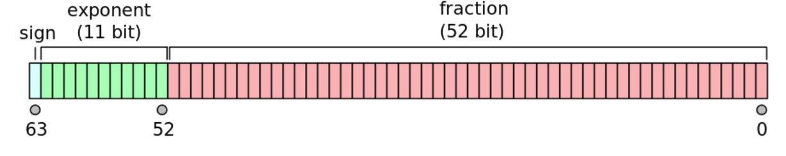

# Measurements

## Intoduction
Many small (and large) devices send and receive measurements and therefor the handling of measurements has been a central design goal for VSCP from the beginning of the protocols existence.

A measurement is a value that originate from a device. It has a value and a unit. Furthermore the timing for the measurement may be important both in an absolute time and in a relative high resolution time. It is important (obviously) to be able to identify the sensor from where the measurement was sent.

Even if most designers agree on the need for the above a lot of measurements is still sent over the wire as magical numbers. In some cases som arbitrary text is added to identify the source and the unit of the measurement. But many times th eunit, format, timing and sensor location is just arbitrary info that should be known by the receiving side by other means then the message that carry the measurement.

A typical example is a temperature measurement. Most often it will be sent over the wire as just a value (magic number). You have to know beforehand if the unit is Fahrenheit, Kelvin or degrees Celsius or sometimes it can even use some other strange temperature unit or scaled value. It's no rule for how the unit is represented if it is there. Furthermore sometimes a '.' may be used as decimal separator, sometimes ',' may be used instead. All this usually is perfectly fine if data is not shared with other parties. But if they are things can be very confusing and even dangerous in some instants when important data is interpreted wrong.

VSCP standardize both the data format and the units. Units come from the well accepted si-units and it's derived units. So for temperature as an example the defined units are Kelvin (si unit), Celsius and Fahrenheit. It is no problem if one sensor sends the measurement in one unit and another sends it in a different unit. The conversions between them are all well defined, standard and secure. The implication is of course that software that work with the measurements can have a standard way to handel them. Meaning more stable and less code and most important code needs to be written once.

Again if we look at VSCP temperature measurement code that is developed to display temperature diagrams the same code can be used to display barometric pressure or some other measurement without modification other than taking the VSCP measurement unit and scaling of values into account. This also allow applications to be easily shared and extends interoperability.

VSCP have many classes defined for measurements. This may look just to much and appear hard to work with at first, but remember that VSCP is designed for tiny senors and devices with limited resources. VSCP let the sensor or device select the measurement class that works best for that particular device and require that higher level devices - which have the necessary resources - to deal with the complexity introduces by having many different measurement classes. Actually all this extra complexity is open fully transparent for a developer/user. An example ís [the VSCP daemon](https://docs.vscp.org/#vscpd) which can translate events from low level drivers to level II measurements (string or float) automatically so there is no need at all for higher level tools to work with the different sorts of measurement events that is available.

## Level II (high level) measurement classes

At a higher level you normally work only with two types of measurement values, strings or double precision floating point. All the other lower level measurements are for less capable devices and it would be no meaning to use them here in other cases other than direct communicating with lower end devices where you need to send a measurement on to a remote node that require a low level measurement event.

[The VSCP daemon](https://docs.vscp.org/#vscpd) can for example automatically translate any event from a low end node to either the string or the floating point VSCP classes.

Level II measurement events are coupled to level I measurements events in in this way

 * 0-255 is mirrored to CLASS1_MEASUREMENT
 * 256-511 is mirrored to CLASS1_MEASUREMENTX1
 * 512-767 is mirrored to CLASS1_MEASUREMENTX2
 * 768-1023 is mirrored to CLASS1_MEASUREMENTX3
 * 1024-1279 is mirrored to CLASS1_MEASUREMENTX4
 * Events with type >= 1270 are only available in Level II.

### CLASS2.MEASUREMENT_STR

The event that handle string values is the level II class [CLASS2.MEASUREMENT_STR](https://docs.vscp.org/spec/latest/#/./class2.measurement_str). The event data is defined as

#### Data definition

| Byte | Description |
 | :----: | ----------- |
 | 0    | Index for sensor, 0-255. |
 | 1    | Zone, 0-255. |
 | 2    | Subzone, 0-255. |
 | 3    | Unit from measurements, 0-255. |
 | 4..  | String up to the maximum data size 483 digits including a possible decimal point. The decimal pint should always be a "." independent of locale. |

 **Index for the sensor** (sensor index) identifies one of several sensors on a device. The device is itself identified by the GUID it carries. And the sensor of the device is identified by it's sensor index. A device that can handle level II events can therefore have a maximum of 256 sensors. A level I device can have at most seven sensors. You can of course extend this without limitations by giving each sensors it's own GUID. 

 **Zone** and **Subzone** can be used to group devices together. Much like an address.  

 **Unit** is the measurement unit. Each measurement event have one or more units defined. For a level I device there is a maximum of four units. A level II device have the ability to extend this to 256 units. This is however seldom used. 

**Measurement value** The measurement value is a string with maximum length of 483 characters representing a floating point value. Decimal separator is always '.'. Floating point values can be represented in the standard way so '123e5' and '123e-5' is allowed. This means VERY large and VERY small numbers can be represented. Event more or less than standard software can handle in which case custom parsers must be built.

### CLASS2.MEASUREMENT_FLOAT

The VSCP class that handle double precision floating point values is the level II class [CLASS2.MEASUREMENT_FLOAT](https://docs.vscp.org/spec/latest/#/./class2.measurement_float). The event data is defined as

#### Data definition

| Byte | Description |
| :----: | ----------- |
| 0    | Index for sensor, 0-255. |
| 1    | Zone, 0-255. |
| 2    | Sub zone, 0-255.|
| 3    | Unit from measurements, 0-255.|
| 4-11 | 64-bit double precision floating point value stored MSB first. |

**Index for the sensor** (sensor index) identifies one of several sensors on a device. The device is itself identified by the GUID it carries. And the sensor of the device is identified by it's sensor index. A device that can handle level II events can therefore have a maximum of 256 sensors. A level I device can have at most seven sensors. You can of course extend this without limitations by giving each sensors it's own GUID. 

 **Zone** and **Subzone** can be used to group devices together. Much like an address.  

 **Unit** is the measurement unit. Each measurement event have one or more units defined. For a level I device there is a maximum of four units. A level II device have the ability to extend this to 256 units. This is however seldom used. 

**Measurement value** The measurement value is a 64-bit double precision floating point value stored MSB first.

## Level I measurement classes

There are many measurement types in VSCP and more will be defined as time goes. The goal is to have all SI units defined and also there derivatives as needs arise. But as measurements are a very important part of every IoT/M2M protocol there are also many classes defined which carry the measurement types. Each class with it's own properties. 

[CLASS1.MEASUREMENT (10)](./class1.measurement.md) is the main measurement class for VSCP measurements. This class has root for 256 measurement types. For future expansion [CLASS1.MEASUREMENT (11)](./class1.measurementx1.md), [CLASS1.MEASUREMENTX2 (12)](./class1.measurementx2.md), [CLASS1.MEASUREMENTX3 (13)](./class1.measurementx3.md), [CLASS1.MEASUREMENTX4 (14)](./class1.measurementx4.md) is available. Each have room for an additional 256 measurement types. This is the same for all level I measurement classes.

See level II classes above for how this maps into high level measurements.

### CLASS1.MEASUREMENT

[CLASS1.MEASUREMENT (10)](./class1.measurement.md) This is the main measurement class. It is built to be as resource efficient as possible if that is what one want but it also accept single precision floating point and strings.

**VSCP_CLASS2_LEVEL1_MEASUREMENT** is the same as CLASS1.MEASUREMENT except that it's class is defined as 512 + 10 and that the first 16-byte of data is the interface GUID where the Level I event carried over Level II should be delivered as a Level I event again at the receiving ends interface defined by the interface GUID.

### CLASS1.MEASUREMENT64

[CLASS1.MEASUREMENT64(60)](./class1.measurement64.md) is used for double precision floating point measurements over Level I. Sensor index is always zero for this measurement type and so is the measurement unit so a temperature for example must be sent with Kelvin as it's unit. Working in a low end device this may be the only way to get this kind of precision but if it is possible to afford the overhead of Level II then [CLASS2.MEASUREMENT_FLOAT(1060)](./class2.measurement_float.md) is a much better choice.

**VSCP_CLASS2_LEVEL1_MEASUREMENT64** is the same as CLASS1.MEASUREMENT64 except that it's class is defined as 512 + 10 and that the first 16-byte of data is the interface GUID where the Level I event carried over Level II should be delivered as a Level I event again at the receiving ends interface defined by the interface GUID.

### CLASS1.MEASUREZONE

[CLASS1.MEASUREZONE(65)](./class1.measurezone.md) is used to send measurement events where zone/subzone is needed.

**VSCP_CLASS2_LEVEL1_MEASUREMENTZONE** is the same as CLASS1.MEASUREZONE except that it's class is defined as 512 + 10 and that the first 16-byte of data is the interface GUID where the Level I event carried over Level II should be delivered as a Level I event again at the receiving ends interface defined by the interface GUID.

### CLASS1.MEASUREMENT32

[CLASS1.MEASUREMENT32(70)](./class1.measurement32.md) is used to send single precision floating point values. Note that this is also possible with [CLASS1.MEASUREMENT (10)](./class1.measurement.md)

**VSCP_CLASS2_LEVEL1_MEASUREMENT32** is the same as CLASS1.MEASUREMENT32 except that it's class is defined as 512 + 10 and that the first 16-byte of data is the interface GUID where the Level I event carried over Level II should be delivered as a Level I event again at the receiving ends interface defined by the interface GUID.

### CLASS1.SETVALUEZONE

[CLASS1.SETVALUEZONE(85)](./class1.setvaluezone.md) is used to configure values on a remote node. Index, zone and subzone specify the node(s).

**VSCP_CLASS2_LEVEL1_SETVALUEZONE** is the same as CLASS1.SETVALUEZONE except that it's class is defined as 512 + 10 and that the first 16-byte of data is the interface GUID where the Level I event carried over Level II should be delivered as a Level I event again at the receiving ends interface defined by the interface GUID.


## VSCP data coding :id=datacoding

For the measurement class and the data class all data is sent in a form that is related to the default format of the data. The number of data bytes in the frame also reflects the size of the variable. In this definition there is a very important assumption. If two nodes should be able to talk to each other they have to know each others data formats. So our assumption is that if a node is interested in what another node has to say it must learn its data format. Also if a node needs to control another node it has to learn its data format to do so.

As a guideline the format defined bellow for the first data byte of a data frame can be used but if a user likes to use another format it is perfectly fine to do so. 

### Definitions for bits in control byte

 | coding(bits 7,6,5) | unit (bits 4,3) | Sensor index (bits 2,1,0) | 
 | ------------------ | --------------- | ------------------------- | 

Tells how data that follows should be interpreted. This is used for [CLASS1.MEASUREMENT](./class1.measurement.md) and [CLASS1.DATA](./class1.data.md) among others. 

#### Control byte, coding - Bits 5,6,7

Represent one of several numerical representations in which the data that follows can be represented as. 

##### 000b Bit Format

The data should be represented as a set of bits. This can be used for picture coding etc. 

##### 001b Byte Format( 0x20 )

The data should be represented as a set of bytes. 

##### 010b String Format( 0x40 )

The data should be represented as an ASCII numerical string. Max seven characters that together represent a number. A "." should always be used as possible decimal separator independent of locale. Example “-123”, “1.3456”, “0.00001” etc

##### 011b Integer Format( 0x60 )

Data is coded as a signed integer. The integer is coded in the bytes that follows and can be 1-7 bytes where the most significant byte always is in byte 1 (big endian).


*  If total event length=2 the data is a 8-bit integer or 1 byte. 
*  If total event length=3 the data is a 16-bit integer or 2 bytes. 
*  If total event length=4 the data is a 24-bit integer or 3 bytes. 
*  If total event length=5 the data is a 32-bit integer or 4 bytes.
*  If total event length=6 the data is a 40-bit integer or 5 bytes. 
*  If total event length=7 the data is a 48-bit integer or 6 bytes. 
*  If total event length=8 the data is a 56-bit integer or 7 bytes. 

##### 100b Normalized integer format( 0x80 )

Data is coded as a normalized integer. In this case the format byte is followed by the normalizer byte.

The normalizer byte is the exponent of the following integer and coded as 'sign (bit 7) and magnitude (bits 0-6)', representing an exponent in the range-(2^{6}-1) to 2^{6}-1. Thus bits 0-6 describe how many places the decimal point has to be shifted and bit 7 the direction of the shift (0 = right; 1 = left).

The actual integer (mantissa) is coded in the bytes that follows and can be 1-6 bytes where the most significant byte always is in byte 2. This integer is always signed and given as a two's complement number.

###### Example

    0x02 0x1B 0x22
    0x1B22 = 6946 decimal
    0x02 has bit 7 cleared meaning the decimal point has to be shifted 2 steps to
     the right i.e. the value is 6946 * 10^2 = 694600
     which is the same as multiplying the value by 10^2 = 100

###### Example

    0x85 0x8D
    0x8D = -115 decimal
    0x85 has bit 7 set meaning the decimal point has to be shifted 5 steps to the 
     left i.e. the value is -115 * 10^(-5) = -0.00115
     which is the same as dividing the value by 10^5 = 100000

###### Example

    0x81 0x01 0x07
    0x0107 = 263 decimal
    0x81 has bit 7 set meaning the decimal point has to be shifted 1 step to the 
     left i.e. the value is 263 * 10^(-1) = 26.3
     which is the same as dividing the value by 10^1 = 10 

#####  101b Floating point value( 0xA0 )

Data is coded as a IEEE-754 1985 floating point value

    s eeeeeeee mmmmmmmmmmmmmmmmmmmmmmm 

That is a total of 32-bits. The most significant byte is stored first. The frame holds a total of five bytes. The full definition is at [https://www.psc.edu/general/software/packages/ieee/ieee.html] and further info at [https://en.wikipedia.org/wiki/IEEE_754-1985]

**Clarification**: A VSCP event use big endian for all numeric types (network byte order) and a PC usually little endian so the byte order should be shifter on such a machine before converting to a floating point value

###### Example

A measurement with this payload

```
0xAE 0x41,0x83,0x80,0x00
```
First byte (0xAE) is the data coding byte which is 

```
101 01 110
```

The left most bits **101** is the code for a floating point value. 

**01** is the unit. In this case degrees Celsius.

**110** is the sensor index. In this case sensor six.

The bytes of the floating point value must be revered. Forming

```
0x00,0x80,0x83,0x41
```
which you can print out with something like this

```
float fvalue;
memcpy( (uint8_t *)&fvalue, (uint8_t *)&iv4, 4 );
printf("Measurement: %f\n", fvalue);
```

which in this case will print

```
16.437500
```

##### 110b Double precision floating point value.( 0xC0 )

Can not be used in all level I measurement classes as it will not fit but is defined for completeness as there are classes that handle double precision floating point values but that just use the data coding implicitly.

Storage is IEEE 754-2008 standard.



##### 111b Reserved( 0xE0 )

The format is yet to be defined.

#### Control byte, unit - Bits 3,4

This bits tell how the data should be interpreted. Typically this is a unit like Centigrade, Fahrenheit or Kelvin for a temperature value. 00b Standard unit. All other codes in this field are event class/type specific.

#### Control byte, sensor index - Bits 0,1,2

Zero based sensor index which can be used if there are more then one sensor handled by the node.


[filename](./bottom_copyright.md ':include')