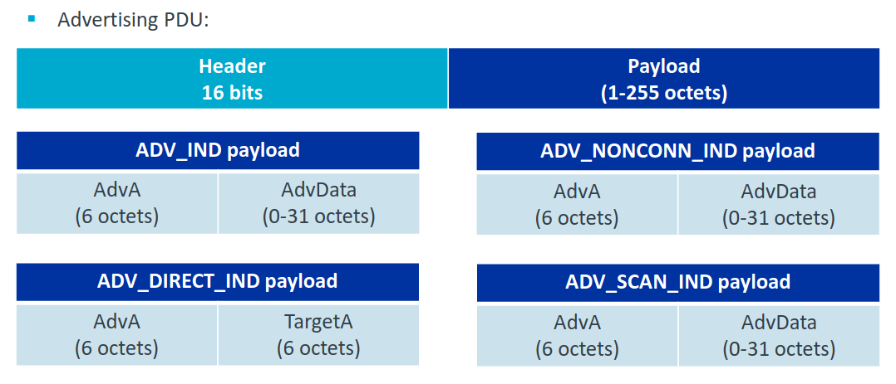

# VSCP over BLE

The general BLE frame format is as follows

VSCP devices can be of two type. Beacon devices that send out advertising packets and connected devices that can be connected to a central device. The advertising packets are used to send out VSCP data without the need for a connection. This is useful for devices that need to send out data but do not need to be connected all the time.

VSCP Beacon data packets is always initially sent unencrypted. A VSCP beacon device is connectable and scannable. If you want to have a secure connection you need to connected to the device. The connected device can be used to send and receive data in a secure way. 

Bluetooth 5 also enables an advertising packet to hold up to 255 bytes of data, which is a lot larger than the 31 bytes that was possible in Bluetooth 4.0 up to Bluetooth 4.2. This makes it possible to support more data for VSCP level II frames. The advertising packet can also be sent out at a much higher rate than before. This makes it possible to send out more data in a shorter time. This is useful for devices that need to send out data but do not need to be connected all the time.

These features require both devices to be Bluetooth 5 compatible, which isn't currently very common as most smartphones are still support v4.2 or older. But over time this feature will begin getting traction and getting used in a number of applications.

## VSCP legacy beacon devices

The general BLE advertising format is max 32 bytes and for VSCP as follows

| Description | Size | Note |
| --- | --- | --- |
| length | 1 byte | Length for name |
| type | 1 bytes | Type for name. 6 |
| name | 0-10 bytes | Device real text name |
| Manufacturer | 2 bytes | Bluetooth manufacturer id, use 0xFFFF for test. Note that little endian is used for this value. |
| Flags | 1 byte | 0x01 |
| **node id** | 2 bytes | Node id. This is the last two bytes of the GUID. |
| **head** | 1 byte | VSCP Head. Bit 4 is always set to one (hardcoded). |
| **vscp-class** | 2 bytes | VSCP class |
| **vscp-type** | 2 bytes | VSCP type |
| **sizeData** | 1 byte | Number of data bytes (0-8/24). |
| **VSCP data** | 8 bytes | VSCP data (unused bytes set to zero) |

The VSCP part of the advertisement frame is always 16 bytes long (bold in table). This is true even if the data field is less than 8 bytes. In this case the data field is padded with zeros to make it 8 bytes long. This is because we want a 16-byte part of the frame which we can encrypt with AES-128 ECB.

Bold data is part iof encrypted part of frame.

**cnt** can be 0-8/24 bytes.  If cnt is greater then 8 bytes (9-24) a response frame will be used to send the extra data bytes. More information about this below. This makes it possible to send certain VSCP level II events who's data fits in the 24 byte max data limit.

  * GUID is constructed from BLE MAC, prefix _FF:FF:FF:FF:FF:FF:FF:F8:YY:YY:YY:YY:YY:YY:XX:XX_ where _YY:YY:YY:YY:YY:YY_ is the BLE MAC and _XX:XX_ is the node id. 
  * obid is set by receiver, zero if not used.
  * time fields is set by receiver
  * Encryption block is [node-id, head, vscp-class, vscp-type, cnt, VSCP-data (always 8-bytes)]

### Flags
| Bits | Description |
| --- | --- |
| 0-3 | Frame version (currently 0) |
| 4-6 | Reserved |
| 7 | Frame is encrypted (if set). |

### Head
This is the 8 low bits of the VSCP standard header.

### Scan response
The scan response is used to send back data to the device that sent the scan request. For a VSCP BLE node the scan request contain the following data

| Description | Size | Note |
| --- | --- | --- |
| timestamp | 4 bytes | Microsecond timestamp |
| **data** | 16 bytes | Extra data. The extra data is either 0 or 16 in length padded with zero. |

Data is encrypted if the encryption bit is set in the advertising frame.

## VSCP connectable devices

When a VSCP device advertise it uses **ADV_IND**  This means the beacon frames are scannable and connectable. 

Beacon frames will not be available after the connection is established.

### Characteristics

| Description | Size | Note |
| --- | --- | --- |
| Name | 11 bytes | Name of device |
| Key | 16 bytes | Encryption key |
| Period | 1 bytes | Advertising period |

Appearance is one of - https://www.bluetooth.com/wp-content/uploads/Files/Specification/Assigned_Numbers.html#bookmark49

## BLE 5.0 format

To be defined.

[filename](./bottom_copyright.md ':include')