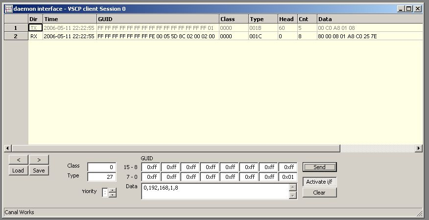

# VSCP tcp/p link protocol

This protocol can be used by tcp/p based nodes to export an interface to it's VSCP functionality.

# VSCP Daemon tcp/p Control Interface
 
The tcp/p interface is a very powerful tool to control the VSCP daemon remotely as it allow for full control of the functionality of the daemon. Originally the tcp/p interface was added to allow for a more secure way to send events over tcp/p links. This interface will have a fair better chance to work over wireless and other links that are hard to get to work reliable with UDP.  

## GUID assigned to the interface

Just as with all clients that connect to the daemon each TCP client interface gets a GUID assigned to it. This GUID is assigned by setting it to the GUID the interface was assigned at start up (in the [configuration file](./configuring_the_vscp_daemon.md) ). This means that a client GUID has the following general form

    yy yy yy yy yy yy yy yy yy yy yy yy client_id_MSB client_id_LSB 0 0

where the the assigned GUID is represented by yy and client_id is a system unique ID for this client interface.

If no GUID is assigned in the configuration file the Ethernet MAC address of the computer vscpd is running on using the VSCP Ethernet assignment method ( see Assigned GUID's ). This results in a GUID of the following form

    FF FF FF FF FF FF FF FE yy yy yy yy client_id_MSB client_id_LSB 0 0 

where yy is the four most significant bytes of the Ethernet address and FF is decimal 255. Note that as the two least significant bytes of the MAC address is dropped there is a chance for duplicated GUID's in a network with more then one machine with a network card from the same manufacturer. In this case set a unique GUID in the configuration file.

Another possibility is to use the IP address of the computer

    FF FF FF FF FF FF FF FD yy yy yy yy client_id_MSB client_id_LSB 0 0 

where yy is the IP address and FF is decimal 255.

The client_id is present in each VSCP event data structure and if a client uses more then one connection to the daemon this client_id can be used to detect events that it has sent itself when they arrive on the other open interfaces. This is typical used when the [RCVLOOP](./vscp_tcpiplink.md.md#tcpip-rcvloop) command is issued where typically one interface is used to send events and another is used to receive events. By saving the client_id for the transmitting channel events that is sent on this channel can be detected on the receive channel.

When an event is sent from the driver interface (a CANAL event) the nickname-ID is stored in the LSB GUID byte (GUID[0]). 

## Server discovery

A node that needs a TCP connection to a server broadcasts High end server probe Class=0, Type = 27 (0x1B) on the segment and waits for High end server response Class=0, Type = 28 (0x1C) from one or more servers that serve the segment. If a suitable server has responded it can decide to connect to that server.

A daemon like the VSCP daemon can span multiple segments and a reply can therefore be received from a remote segment as well. This can be an advantage in some cases and unwanted in other cases. The server configuration should have control on how it is handled.

As an example: In this picture VSCP Works has been used to broadcast a High end server probe from the machine with IP address 192.168.1.8 - Data is 0,192,168,1,8 - The initial zero indicates that this is a tcp/p based device. The server that in this case is on the same machine have answered with a High end server response with data set to

    80 00 08 01 A8 C0 25 7E

The first two bytes is the bit-filed that tells the Code for server capabilities. After that follows the server IP address (192.168.1.8) followed by the VSCP default port 9598.
In clear text, this server has a VSCP tcp/p interface available at the standard port.
Other scenarios could be possible of course such as several servers responding and each of the servers supporting different capabilities.

The High end server probe and High end server response is described here [Class=0 (0x00) VSCP Protocol Functionality - CLASS1.PROTOCOL](http://docs.vscp.org/spec/latest/#/./class1.protocol?id=type27-0x1b-high-end-serverservice-probe)

A node can react in its own manner on the response. It can connect to the server itself or wait for the server to connect to the node.

VSCP Daemon tcp/p interface security
The tcp/p interface is protected by a user/password pair. The username is sent as clear text over the net but the password is a hash over "username:authdomain|raltext-password".((authdomain is described here )

I addition to the username/password which also groups users in security levels it is possible to have table where the hosts allowed to connect to the system is stored.

In addition to this SSL can be enabled on the interface.

Also a privilege based system is used to protect critical functionality. A user need a specific privilege to send an event for example and can be set up to be allowed just to send a limited set of events. Also a filter on incoming events is possible to set up to limit what a user can receive.

Remote user settings are configured here.

Put together this makes the VSCP Daemon one of the safest systems to use for remote maintenance of IoT/m2m systems.

## Secure the TCP link

A very flexible security schema is available for the VSCP daemon tcp/p inteface. Each user is defined with a list of parameters 

    username

A name that this user is refereed to and known by. Always required for all users. 

    password

A password this user must give to sign in. Always required for all users. Stored in configuration files as MD5 of password.

    host-list

A list with locations/computers/networks this user can access the daemon. Wild-card can be used so access from a single computer can be set as “192.168.1.8” but access for the hole subclass can be set as “192.168.1.*”.

    access-rights

This is the access level this user have. This is a 32-bit value where the lower four bits define a value 0-15 that defines a privilege value which gives access to different levels of commands. The upper part of the 32-bit value is a bit field with specific rights.

## Username/password pairs for Level II drivers

Level II drivers is started through the normal driver interface, but after the start it also do some of its communication through the tcp/p interface. It can also use the variables defined in the system for its own configuration and state. A driver of this type needs a username/password pair and it could be defined for the driver in the configuration but an internal schema create these credentials automatically if they are not manually configured. The Host-list for the user drivers to be used, should always be the Localhost to increase security.

[filename](./bottom_copyright.md ':include')

# tcp/p Link interface protocol description

## Port

Default Port for the tcp/p interface is 9598 but the interface can be available on several port and several interfaces on a specific hardware.

## Command and response format

The VSCP TCP protocol is very much like the POP3 protocol.

*  A command is sent (ending with CRLF)

*  A response line is received starting with either ”**+OK**” for success or ”**-OK**” for failure. The initial “token” is followed by some descriptive text that is separated from the initial token with “ - “ (a dash with a space on it's both sides).

For some commands there can be data in between the two lines. For instance the “**VERS**” command looks like this

    send: 'VERS<CR><LF>
    received line 1: '1,0,0<CR><LF>
    received line 2: '+OK - <CR><LF>

## VSCP Link Interfaces (VSCP-LI)

The daemon interface can be visible also on lower end (typically tcp/ip) nodes. A subset of the commands are required to be available on such a node. Commands marked with yes in the link column below are the ones that a link node should have. All others are not mandatory on this type of nodes.

## List of available commands

 | Command  | Privilege | Link | From version | Description  |
 | :------- | :--: | :----: | :------------: | -----------  |
 | +        | 0         | yes  | 0.0.2        | Repeat the last command  |
 | [NOOP](./vscp_tcpiplink.md#tcpip-noop) | 0  | yes  | 0.0.1 | No operation. |
 | [HELP](./vscp_tcpiplink.md.md#tcpip-help) | 0  | no   | 0.0.2 | Give command help. |
 | [QUIT](./vscp_tcpiplink.md.md#tcpip-quit) | 0  | yes  | 0.0.1 | Close the connection. |
 | [USER](./vscp_tcpiplink.md.md#tcpip-user) | 0  | yes  | 0.0.1 | Username for login. |
 | [PASS](./vscp_tcpiplink.md.md#tcpip-pass) | 0  | yes  | 0.0.1 | Password for login. |
 | [CHALLENGE](./vscp_tcpiplink.md.md#tcpip-challenge) | 0         | yes  | 1.12.14.4 | Get session id. |
 | [SEND](./vscp_tcpiplink.md.md#tcpip-send) | 4         | yes  | 0.0.1 | Send an event. |
 | [RETR](./vscp_tcpiplink.md.md#tcpip-retr) | 2         | yes  | 0.0.1 | Retrieve one or several event(s). |
 | [RCVLOOP](./vscp_tcpiplink.md.md#tcpip-rcvloop) | 2         | yes  | 0.0.2        | Will retrieve events in an endless loop until the connection is closed by the client.  |
 | [QUITLOOP](./vscp_tcpiplink.md.md#tcpip-quitloop) | 2         | yes  | 0.4.29 | Terminate RCVLOOP |
 | [CDTA/CHKDATA](./vscp_tcpiplink.md.md#tcpip-chkdata) ((Both versions of the command should be supported))    | 1    | yes  | 0.0.1 | Check if there are events to retrieve. |
 | [CLRA/CLRALL](./vscp_tcpiplink.md.md#tcpip-clrall) ((Both versions of the command should be supported)) | 1         | yes  | 0.0.1 | Clear all events in in-queue.                                                                      |
 | [STAT](./vscp_tcpiplink.md.md#tcpip-stat) | 1         | yes  | 0.0.1 | Get statistics information. |
 | [INFO](./vscp_tcpiplink.md.md#tcpip-info) | 1         | yes  | 0.0.1 | Get status information. |
 | [CHID/GETCHID](./vscp_tcpiplink.md.md#tcpip-chid) ((Both versions of the command should be supported)) | 1         | yes  | 0.0.1 | Get channel ID. |
 | [SGID/SETGUID](./vscp_tcpiplink.md.md#tcpip-setguid) ((Both versions of the command should be supported)) | 6         | yes  | 0.0.1 | Set GUID for channel. |
 | [GGID/GETGUID](./vscp_tcpiplink.md.md#tcpip-getguid) ((Both versions of the command should be supported)) | 1         | yes  | 0.0.1 | Get GUID for channel. |
 | [VERS/VERSION](./vscp_tcpiplink.md.md#tcpip-version) ((Both versions of the command should be supported)) | 0         | yes  | 0.0.1 | Get CANAL/VSCP daemon version. |
 | [SFLT/SETFILTER](./vscp_tcpiplink.md.md#tcpip-setfilter) ((Both versions of the command should be supported))            | 6 | yes  | 0.0.1 | Set incoming event filter. |
 | [SMSK/SETMASK](./vscp_tcpiplink.md.md#tcpip-setmask)  | 6         | yes  | 0.0.1 | Set incoming event mask.  |
 | [TEST](./vscp_tcpiplink.md.md#tcpip-test) | 15 | no   | 0.0.2 | Do test sequence. Only used for debugging.  |
 | [SHUTDOWN](./vscp_tcpiplink.md.md#tcpip-shutdown) | 15        | no   | 0.0.2 | Shutdown the device/daemon. |
 | [RESTART](./vscp_tcpiplink.md.md#tcpip-restart) | 15        | no   | 0.0.2 | Restart the device/daemon.  |
 | [INTERFACE](./vscp_tcpiplink.md.md#tcpip-interface) | 15        | yes   | 0.0.2 | Interface manipulation. Have secondary commands. |
 | [WCYD/WHATCANYOUDO](./vscp_tcpiplink.md.md#tcpip-whatcanyoudo) ((Both versions of the command should be supported)) | 0         | yes  | 0.4.29 | Request what this sever can do |

## NOOP - No operation :id=tcpip-noop

This operation does nothing. It just replies with ”**+OK**”.

## TEST - Run tests :id=tcpip-test

Run device specific tests. Command can have arguments. It replies with ”**+OK**” if test(s) is OK, error code otherwise. 

##  QUIT - Close the connection :id=tcpip-quit

Close the connection to the host.

##  HELP - Give help :id=tcpip-help

'HELP' alone gives help about all commands. 'HELP command" gives command specific help.

## USER - Username for login :id=tcpip-user

Used to enter username for a password protected server.

Used on the following form:

    USER username<CR><LF>

## PASS - Password for login :id=tcpip-pass

Used to enter username for a password protected server.

Used on the following form:

    PASS password<CR><LF>

## CHALLENGE - Get challenge session id :id=tcpip-challenge

Used to get a session unique id

Used on the following form:

    CHALLENGE password<CR><LF>

and give a response such as

    +OK - e14712fa9d6a62ff388a701848e24a32

where "e14712fa9d6a62ff388a701848e24a32" is the 32 byte sid.

## RESTART - Restart daemon :id=tcpip-restart

Restart the daemon. Must have highest privilege to be able to do this.

##  SHUTDOWN - Shutdown daemon :id=tcpip-shutdown

shutdown the daemon. Must have highest privilege to be able to do this.

## SEND - Send an event :id=tcpip-send

Used on the following form:

    send head,class,type,obid,datetime,timestamp,GUID,data1,data2,data3....
or
    send $variablename

**Important note** datetime is introduced in version *1.12.20.0*

The GUID is given on the form MSB-byte:MSB-byte-1:MSB-byte-2……. The GUID can also be given as ”-” in which case the GUID of the interface is used for the event. This GUID is constructed from the Ethernet MAC address and some other parameters to be globally unique.

**datetime** is UTC date time (Coordinated Universal Time) on ISO format
    YYYY-MM-DDTHH:MM:DD
Can be empty left empty and in that case the current UTC date/time is set by the system.

If timestamp is a relative time in microseconds. It can be empty in which case a timestamp will be set by the system. Before version *1.12.20.0* a timestamp of zero would be replaced by a system set timestamp this is not the case anymore.

Note: obid is just a place holder here to have a similar line as the receive command and is used internally by the daemon as an interface index. The value you use will always be overwritten by the daemon. head is currently not used.

CLASS=512 - CLASS=1023 is treated in a special way by the daemon. If you use the interface GUID as the first sixteen data bytes the event will only be set through that interface. This is the correct way to send a Level I event through the daemon. You can send Level I events without the GUID also but in that case the event will be sent out on all interfaces and as each interface can have nodes with this nickname all will be affected.

The variable send form makes it possible to send the content in a variable that is of type event. In this case give the name of the variable as argument preceded with a dollar ('$') sign.

**head** is defined as
    bit 7,6,5 priority => Priority 0-7 where 0 is highest.
    bit 4 = hard coded, true for a hard coded device.
    bit 3 = Don't calculate CRC, Set to zero to use CRC.
    bit 2 = Undefined.
    bit 1 = Undefined.
    bit 0 = Undefined.

**Example:**
Send a full GUID event

    send 0,20,3,,,,0:1:2:3:4:5:6:7:8:9:10:11:12:13:14:15,0,1,35<CR><LF>

Send Event. The example is the same as above but the GUID of the interface will be used.

    send 0,20,3,,,,-,0,1,35<CR><LF>

Send event with UTC time set

    send 0,20,3,,2001-11-02T18:00:01,,-,0,1,35<CR><LF>

Both send the [CLASS1.INFORMATION TYPE=3 ON event](http://docs.vscp.org/spec/latest/#/./class2.level1.information1), for zone=1, sub-zone=35

**Send event to specific interface**
It is possible to send Level I events to a specific interface. To do this use the Level II mirror Level I events ( Class=512-1023 VSCP Level II Level I events - CLASS2.LEVELI). This is events with class equal to 512 - 1023 which mirrors the Level I events but have the destination GUID in data bytes 0-15. Thees data-bytes is set to the interface (14 upper bits) and the node-ID for the node one wants to communicate with is in GUID[0]. This event will be sent to the correct interface.

So the above example would be

    send 0,20,3,,,0,-,15,14,13,12,11,10,9,8,7,6,5,4,3,2,0,0,1,35<CR><LF>

where class becomes *532* (512 + 20) and where *15,14,13,12,11,10,9,8,7,6,5,4,3,2,0,0* is the interface the events should be routed to. Note the two zeros at the two least significant bytes which is always zero for an interface and is used for node id's.

**Send content of variable**

    send $tempevent1

In this example the content of the variable tempevent1 is sent. The variable is of type event.

## RETR - Retrieve one or several event(s) :id=tcpip-retr

This command can be used to retrieve one or several events from the input queue. Events are returned as

    head,class,type,obid,datetime,timestamp,GUID,data0,data1,data2,...........

**Important note** datetime was added in version *1.12.20.0*

GUID with MSB first.

Used on the following form:

    RETR 2<CR><LF>

which gives

    0,20,3,0,2001-11-02T17:43:15,0,FF:FF:FF:FF:FF:FF:FF:FE:0:5:93:140:2:32:0:1
    0,20,4,0,2001-11-02T17:43:15,0,FF:FF:FF:FF:FF:FF:FF:FE:0:5:93:140:2:32:0:1
    +OK - Success

If no events is available in the queue

	-OK - No event(s) available

is received by the client.

If you try to fetch more events then there are in the queue you will get

    retr 100
    0,1,1,4,2001-11-02T17:43:15,0,FF:FF:FF:FF:FF:FF:FF:FF:FF:FF:FF:F5:00:04:00:00
    0,1,1,4,2001-11-02T17:43:15,0,FF:FF:FF:FF:FF:FF:FF:FF:FF:FF:FF:F5:00:04:00:00
    0,1,1,4,2001-11-02T17:43:15,0,FF:FF:FF:FF:FF:FF:FF:FF:FF:FF:FF:F5:00:04:00:00
    0,1,1,4,2001-11-02T17:43:15,0,FF:FF:FF:FF:FF:FF:FF:FF:FF:FF:FF:F5:00:04:00:00
    0,1,1,4,2001-11-02T17:43:15,0,FF:FF:FF:FF:FF:FF:FF:FF:FF:FF:FF:F5:00:04:00:00
    0,1,1,4,2001-11-02T17:43:15,0,FF:FF:FF:FF:FF:FF:FF:FF:FF:FF:FF:F5:00:04:00:00
 1. OK - No event(s) available

You request 100 events but there is only 6 available so you get a negative reply.

VSCP Event originating from a CANAL driver have the nickname of the node in the LSB of the GUID ( GUID[15] ). The rest of the GUID is the GUID for the interface.

If no argument is given one event is fetched even if there are more in the queue.

If you try to receive more events then there is events in the buffer -OK will be returned after the available number of events have been retrieved and been listed.

## RCVLOOP - Send events to client as soon as they arrive :id=tcpip-rcvloop

This command set the channel in a closed loop that only can be interrupted by a client closing the connection or by sending the CLOSELOOP command. The server will now send out an event as soon as it is reserved. This is done in a very effective way with high throughput. This means the client does not have to poll for new events. It just open one channel where it sends events and do control tasks and one channel where it receive evens.

To help in determining that the line is alive

    +OK

is sent with a two second interval. The format for the event data is the same as for RETR command.

Some applications may not implement this feature and should output

    -OK - Command not implemented<CR><LF>

to indicate this.

## QUITLOOP - quit receiving loop :id=tcpip-quitloop

Quit a receive loop started by the RCVLOOP command.

## CDTA/CHKDATA - Check if there are events to retrieve :id=tcpip-chkdata

This command are used to check how many events are in the input queue waiting for retrieval.

Used on the following form:

    CDTA<CR><LF>

and reply is

    8 <CR><LF>
    +OK<CR><LF>

## CLRA/CLRALL - Clear all events in in-queue :id=tcpip-clrall

This command are used to clear all events in the input queue.

Used on the following form:

   CLRA<CR><LF>

and reply is

    +OK - All events cleared.<CR><LF>

## STAT - Get statistics information :id=tcpip-stat

Get interface statistics information. The returned format is

    x,y,z,cntReceiveData,cntReceiveFrames,cntTransmitData,cntTransmitFrames

Where x,y,z currently is undefined values.

**Example:**

    STAT<CR><LF>

reply is
    0,0,0,12356,56,9182,20<CR><LF>
    +OK - <CR><LF>

## INFO - Get status information :id=tcpip-info

This command fetch the status information for the interface. Returned format is

    channel-status,lasterrorcode,lasterrorsubcode,lasterrorstr

**Example:**

    INFO<CR><LF>

and the reply is

    7812,12,0,"Overrun"<CR><LF>
    +OK - <CR><LF>

## CHID - Get channel ID :id=tcpip-chid

Get the channel ID for the communication channel. This is the same parameter as the obid which is present in events.

**Example:**

    CHID<CR><LF>

and the reply is

    1234<CR><LF>
    +OK<CR><LF>

## SGID/SETGUID - Set GUID for channel :id=tcpip-setguid

Set the GUID for this channel. The GUID is given on the form

The format is:

    SETGUID 0:1:2:3:4:5:6:7:8:9:10:11:12:13:14:15<CR><LF>

or
    SGID 0:1:2:3:4:5:6:7:8:9:10:11:12:13:14:15<CR><LF>

and reply is

    +OK<CR><LF>

## GGID/GETGUID - Get GUID for channel :id=tcpip-getguid

Get the GUID for this channel. The GUID is received on the form

    0:1:2:3:4:5:6:7:8:9:10:11:12:13:14:15<CR><LF>
    +OK<CR><LF>

## VERS/VERSION - Get VSCP daemon version :id=tcpip-version

Get the current version for the daemon. The returned format is

    major-version,minor-version,sub-minor-version,build-version

**Note:** *build-version* added in version 13.0.0.14

## SFLT/SETFILTER - Set incoming event filter :id=tcpip-setfilter

Set the incoming filter. The format is

    filter-priority, filter-class, filter-type, filter-GUID

**Example:**

    1,0x0000,0x0006,ff:ff:ff:ff:ff:ff:ff:01:00:00:00:00:00:00:00:00

Note: The GUID values always is given as hexadecimal values without a preceding “0x”.
Note: If you want to filter on nickname-ID you should filter on GUID LSB byte.

For a device with more than one filter the filter can be specified as an added numeric parameter of the above list. So

    1,0x0000,0x0006,ff:ff:ff:ff:ff:ff:ff:01:00:00:00:00:00:00:00:00,8

will set filter eight and so on.

## SMSK/SETMASK - Set incoming event mask :id=tcpip-setmask

Set the incoming mask. The format is

    mask-priority, mask-class, mask-type, mask-GUID

**Example:**

    1,0x0000,0x0006,ff:ff:ff:ff:ff:ff:ff:01:00:00:00:00:00:00:00:00

Note: that the GUID values always is given as hexadecimal values without a preceding “0x”.
Note: If you want to mask on nickname-ID you should mask on GUID LSB byte.

For a device with more than one filter the mask can be specified as an added numeric parameter of the above list. So

    1,0x0000,0x0006,ff:ff:ff:ff:ff:ff:ff:01:00:00:00:00:00:00:00:00,8

will set mask eight and so on.

## WCYD / WHATCANYOUDO - Ask the capabilities of this server :id=tcpip-whatcanyoudo

This command reports server capabilities of this server.

The capabilities are described in a 64-bit array (8 bytes). The capabilities is reported on the form

    00-00-00-00-00-00-00-00
    +OK

where each pair of hex digits is a byte in the 64-bit capabilities structure. MSB is the first (left most) byte.

The VSCP server 64-bit capability code is described in the specification document for [CLASS2.PROTOCOL, Type=20, High end server/service capabilities](http://docs.vscp.org/spec/latest/#/./class2.protocol?id=type20-0x14-high-end-serverservice-capabilities). It gives information about the capabilities of a VSCP server.

**note**

This response was changed in version 14.0.0 from

    +OK - 00-00-00-00-00-00-00-00

## INTERFACE :id=tcpip-interface

Handle the interfaces on the VSCP daemon. Given without an argument should do the same operation as 'interface list' below.

Also low end devices that implement the vscp tcp/ip link protocol should implement this command. Typical for a devicve of this type is to have only one interface the device itself. Such a device list the full GUID of the device as the device as interface.

### list :id=tcpip-interface-list

List interfaces.

For the list interfaces command the daemon respond with

    'count' rows<CR><LF>
    interface-id1, type, interface-GUID1, interface_realname1<CR><LF>
    interface_id2, type, interface_GUID2, interface_realname2<CR><LF>
    ...
    interface_idn, type, interface_GUIDn, interface_realnamen<CR><LF>
    +OK - Success.<CR><LF>

type is

 | Type | Description |
 | :----: | ----------- |
 | 0    | Unknown (should not see this). |
 | 1    | Internal device/daemon client  |
 | 2    | Level I driver                 |
 | 3    | Level II driver                |
 | 4    | tcp/p interface client         |
 | 5    | UDP interface client           |
 | 5    | Webserver interface client     |
 | 6    | Websocket interface client     |
 | 7    | REST interface client          |

###  close :id=tcpip-interface-close

Close interfaces.

Full format is

    interface close interface_GUID

Unique access to an interface can only be queried once for one interface. So two unique operations after each other deselects the first chosen interface before acquire the second.

Normally interfaces are always open. In this case just reply with a positive response (_+OK\r\n_).

[filename](./bottom_copyright.md ':include')
 